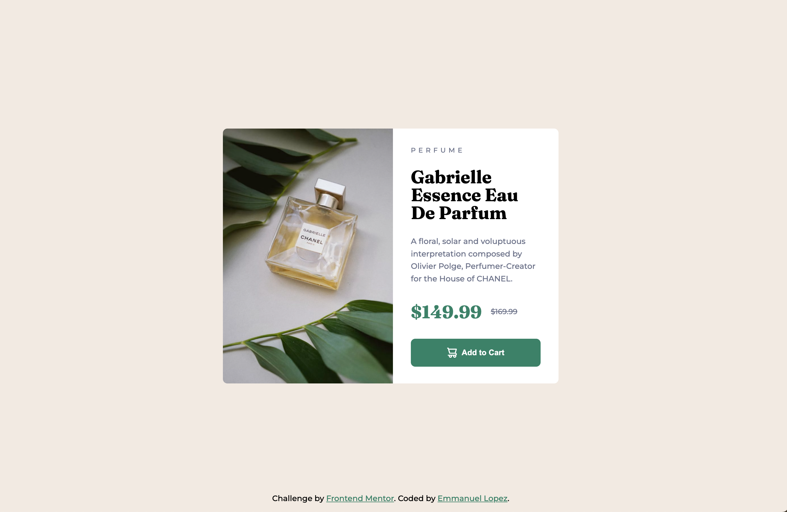

# Frontend Mentor - Product preview card component solution

This is a solution to the [Product preview card component challenge on Frontend Mentor](https://www.frontendmentor.io/challenges/product-preview-card-component-GO7UmttRfa). Frontend Mentor challenges help you improve your coding skills by building realistic projects.

## Table of contents

-   [Frontend Mentor - Product preview card component solution](#frontend-mentor---product-preview-card-component-solution)
    -   [Table of contents](#table-of-contents)
    -   [Overview](#overview)
        -   [The challenge](#the-challenge)
        -   [Screenshot](#screenshot)
        -   [Links](#links)
    -   [My process](#my-process)
        -   [Built with](#built-with)
        -   [What I learned](#what-i-learned)
        -   [Continued development](#continued-development)
        -   [Useful resources](#useful-resources)
    -   [Author](#author)

## Overview

### The challenge

Users should be able to:

-   View the optimal layout depending on their device's screen size
-   See hover and focus states for interactive elements

### Screenshot

### Links

-   Solution URL: [https://github.com/EmLopezDev/Product-Preview-Card](https://github.com/EmLopezDev/Product-Preview-Card)
-   Live Site URL: [https://emlopezdev.github.io/Product-Preview-Card](https://emlopezdev.github.io/Product-Preview-Card)

## My process

### Built with

-   Semantic HTML5 markup
-   SCSS function, variables and nesting
-   Media queries
-   BEM naming convention

**Note: These are just examples. Delete this note and replace the list above with your own choices**

### What I learned

-   The importance of using rem instead of px for accessability reasons
-   The power of SASS/SCSS, creating functions is such a great approach

### Continued development

-   Look more into CSS pre-processors and if they are the better approach to writing CSS as opposed to vanilla CSS
-   Now that I have a better understanding of the importance of REM I want to focus on making font-sizing more responsive and look into using `clamp()`

### Useful resources

-   [Setting up SCSS](https://www.youtube.com/watch?v=LVXUTvJnFYQ) - This helped me how to set up SCSS in a project and how to use it.
-   [PX Vs REM](https://www.youtube.com/watch?v=xCSw6bPXZks&t=111s) - This is helped me better understand the downfall to using px vs rem.
-   [SASS/SCSS](https://sass-lang.com/documentation/) - This is helped me better understand SASS/SCC and what is happening under the hood.
-   [BEM](https://getbem.com/) - This is helped me better understand the BEM naming convention and its benefits.

## Author

-   Frontend Mentor - [@EmLopezDev](https://www.frontendmentor.io/profile/EmLopezDev)
